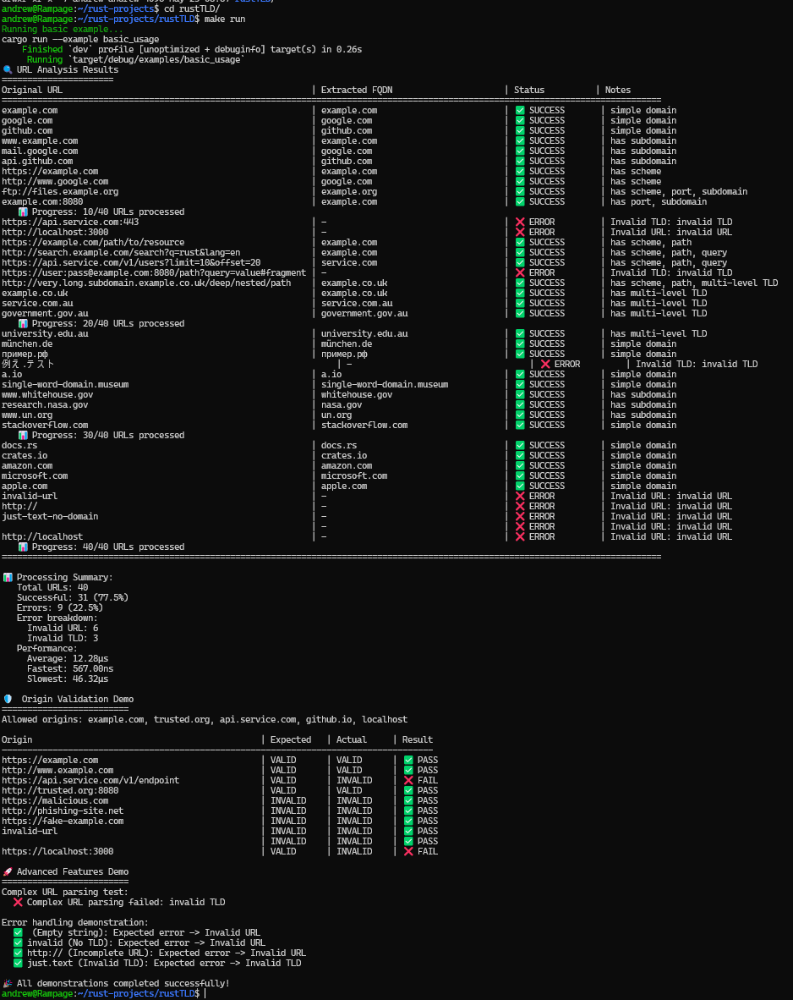

# rust-tld

[](https://crates.io/crates/rust-tld)
[](https://docs.rs/rust-tld)
[](https://opensource.org/licenses/MIT)
[](https://www.rust-lang.org)

A high-performance Rust library for extracting fully qualified domain names (FQDNs) from URLs using the **Mozilla Public Suffix List**. This library provides fast, accurate domain extraction with full async support and thread-safe operations.

## ✨ Features

- 🚀 **High Performance**: Optimized for speed with concurrent processing
- 🔒 **Thread Safe**: Built with Rust's ownership system and async/await
- 🌐 **Standards Compliant**: Uses the official Mozilla Public Suffix List
- 🎯 **Accurate Parsing**: Correctly handles complex domains like `example.co.uk`
- ⚡ **Async First**: Fully async API with sync convenience functions
- 🛡️ **Memory Safe**: Zero-copy operations where possible
- 📦 **Easy Integration**: Simple API with comprehensive error handling

## 🚀 Quick Start

Add this to your `Cargo.toml`:

```toml
[dependencies]
rust-tld = "0.1.0"
tokio = { version = "1.0", features = ["full"] }
```

### Basic Usage

```rust
use rust_tld::{init, get_fqdn};

#[tokio::main]
async fn main() -> Result<(), Box<dyn std::error::Error>> {
    // Initialize the library (downloads Public Suffix List)
    init(None).await?;
    
    // Extract FQDNs from various URL formats
    let fqdn = get_fqdn("https://www.example.com/path?query=value").await?;
    println!("FQDN: {}", fqdn); // Output: example.com
    
    let fqdn = get_fqdn("subdomain.example.co.uk").await?;
    println!("FQDN: {}", fqdn); // Output: example.co.uk
    
    Ok(())
}
```

### Origin Validation

```rust
use rust_tld::{init, validate_origin};

#[tokio::main]
async fn main() -> Result<(), Box<dyn std::error::Error>> {
    init(None).await?;
    
    let allowed_origins = vec![
        "example.com".to_string(),
        "trusted.org".to_string(),
    ];
    
    let is_valid = validate_origin("https://example.com", &allowed_origins).await;
    println!("Valid origin: {}", is_valid); // Output: true
    
    Ok(())
}
```

### Advanced Configuration

```rust
use rust_tld::{init, Options};
use std::time::Duration;

#[tokio::main]
async fn main() -> Result<(), Box<dyn std::error::Error>> {
    let options = Options::new()
        .allow_private_tlds(true)
        .timeout(Duration::from_secs(30))
        .public_suffix_url("https://custom-suffix-list.example.com/list.dat");
    
    init(Some(options)).await?;
    
    // Your code here...
    Ok(())
}
```

## 📸 Example Output



## 🔧 API Reference

### Core Functions

| Function | Description | Returns |
|----------|-------------|---------|
| `init(options)` | Initialize the library with optional configuration | `Result<(), TldError>` |
| `get_fqdn(url)` | Extract FQDN from a URL (async) | `Result<String, TldError>` |
| `get_fqdn_sync(url)` | Extract FQDN from a URL (blocking) | `Result<String, TldError>` |
| `validate_origin(origin, allowed)` | Validate origin against allowlist (async) | `bool` |
| `validate_origin_sync(origin, allowed)` | Validate origin against allowlist (blocking) | `bool` |

### Configuration Options

```rust
pub struct Options {
    pub allow_private_tlds: bool,        // Include private/corporate TLDs
    pub timeout: Duration,               // HTTP request timeout
    pub custom_http_client: Option<Client>, // Custom reqwest client
    pub public_suffix_url: String,       // Custom Public Suffix List URL
    pub public_suffix_file: Option<String>, // Local file path (future)
}
```

### Error Types

```rust
pub enum TldError {
    InvalidUrl,                    // Malformed URL
    InvalidTld,                    // TLD not found in Public Suffix List
    PublicSuffixDownload(String),  // Failed to download PSL
    PublicSuffixParse(String),     // Failed to parse PSL
    PublicSuffixFormat(String),    // Invalid PSL format
}
```

## 🏃‍♂️ Running the Example

Clone the repository and run the interactive example:

```bash
git clone https://github.com/yourusername/rust-tld.git
cd rust-tld

# Run with default test URLs
cargo run --example basic_usage

# Run with custom URLs
cargo run --example basic_usage -- https://github.com https://stackoverflow.com

# Run with options
cargo run --example basic_usage -- --private --timeout 30 --verbose
```

### Example Options

```bash
OPTIONS:
    -h, --help                     Print help information
    -V, --version                  Print version information
        --private                  Allow private TLDs
        --timeout <SECONDS>        Timeout for HTTP requests in seconds [default: 10]
        --url <URL>               Custom URL for public suffix list
    -v, --verbose                  Enable verbose logging

ARGS:
    <URLs>...    URLs to analyze
```

## 🛠️ Use Cases

- **Web Security**: Validate origins and implement CORS policies
- **Domain Analytics**: Extract primary domains from referrer data
- **URL Processing**: Clean and normalize URLs in web crawlers
- **Email Validation**: Validate email domains against known TLDs
- **DNS Tools**: Build DNS analysis and monitoring tools
- **Cookie Management**: Determine appropriate cookie domain scope

## 🔬 Technical Details

### Performance

- **Initialization**: ~500ms (downloads and parses 240KB Public Suffix List)
- **Extraction**: ~10μs per URL (after initialization)
- **Memory Usage**: ~2MB for loaded Public Suffix List
- **Concurrency**: Thread-safe with `Arc` and `RwLock`

### Public Suffix List

The library downloads and caches the official [Mozilla Public Suffix List](https://publicsuffix.org/), which contains:

- **ICANN Domains**: Official top-level domains (.com, .org, .uk, etc.)
- **Private Domains**: Corporate domains (.github.io, .amazonaws.com, etc.)
- **Special Cases**: Complex rules for domains like .co.uk, .gov.au

### Supported URL Formats

```rust
// All of these work correctly:
"example.com"
"www.example.com"
"https://subdomain.example.co.uk"
"http://example.com:8080/path?query=value"
"ftp://files.example.org/directory/"
```

## 🤝 Contributing

Contributions are welcome! Please feel free to submit a Pull Request. For major changes, please open an issue first to discuss what you would like to change.

### Development Setup

```bash
git clone https://github.com/yourusername/rust-tld.git
cd rust-tld
cargo build
cargo test
cargo run --example basic_usage
```

### Running Tests

```bash
# Run all tests
cargo test

# Run tests with output
cargo test -- --nocapture

# Run specific test
cargo test test_fqdn_extraction
```

## 📄 License

This project is licensed under either of

- Apache License, Version 2.0 ([LICENSE-APACHE](LICENSE-APACHE) or http://www.apache.org/licenses/LICENSE-2.0)
- MIT license ([LICENSE-MIT](LICENSE-MIT) or http://opensource.org/licenses/MIT)

at your option.

## 🙏 Acknowledgments

- [Mozilla Public Suffix List](https://publicsuffix.org/) for maintaining the domain suffix database
- [reqwest](https://github.com/seanmonstar/reqwest) for HTTP client functionality
- [tokio](https://github.com/tokio-rs/tokio) for async runtime
- [url](https://github.com/servo/rust-url) for URL parsing

## 📊 Changelog

### v0.1.0 (2024-01-XX)

- Initial release
- Core FQDN extraction functionality
- Public Suffix List integration
- Async API with sync convenience functions
- Origin validation
- Comprehensive error handling
- Thread-safe operations

---

**Made with ❤️ in Rust**